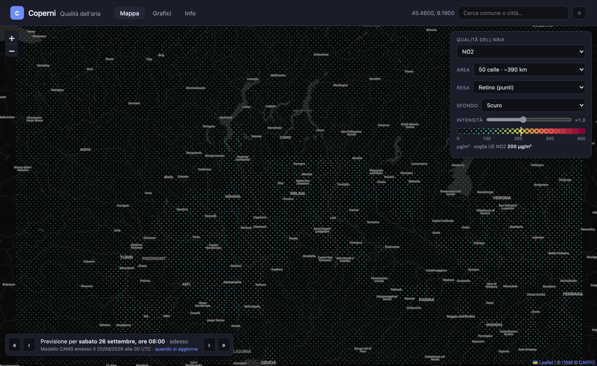
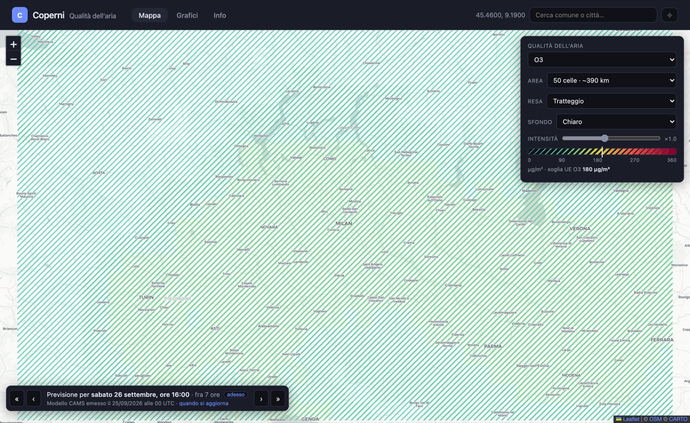
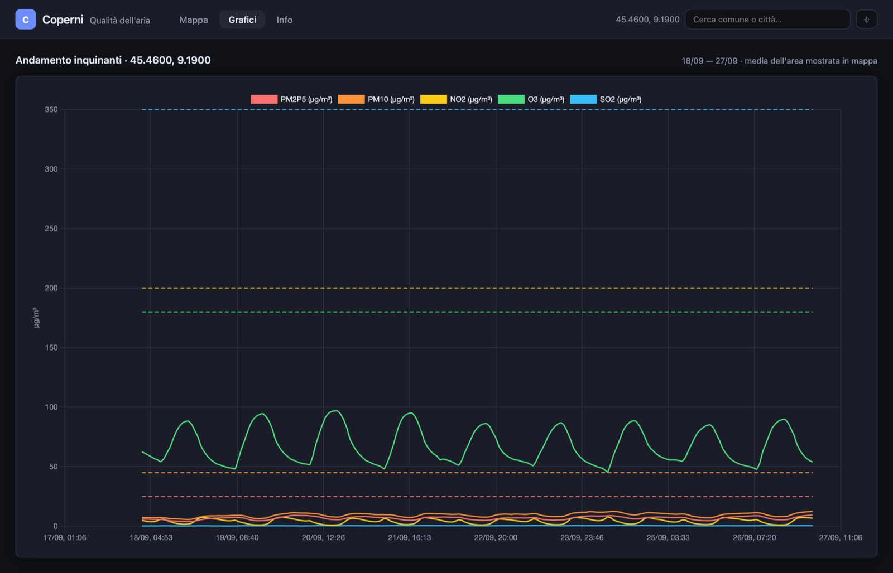

# Coperni

**Air quality forecasts from Copernicus, readable at a glance.**

Coperni shows the European air quality forecast of the
[Copernicus Atmosphere Monitoring Service (CAMS)](https://atmosphere.copernicus.eu/) on a map
centred on an Italian municipality, a European city or any coordinates, plus a chart of how the
pollutants evolved over the past week and what is expected for the next 48 hours.

**Live demo: <https://coperni.azukibeans.dev>**

The user interface is in Italian.



## Why

Air quality data in Europe is public and free, but it usually comes as technical files (NetCDF,
GRIB), expert portals or scattered monitoring stations. Coperni takes the CAMS forecast
and turns it into something anyone can read: a grid of ~10 km cells around the place you care
about, coloured against the European limit values.

It is a public, read-only site. There are no accounts and no tracking. The only cookie remembers
the last place you looked at.

## What you see

- **Map**: the area around the chosen place (20 or 50 cells per side, ~150 or ~390 km),
  one cell every 0.1°. The colour follows `value / threshold`: cyan to green below the EU
  threshold, yellow at the threshold, red above it, purple above twice the threshold. Three
  renderings are available: *halftone* (dot size ∝ concentration), *hatching* (line width ∝
  concentration) and *transparency*. Dark or light basemap. Click a cell to read its value.
- **Time navigation**: step ±1 h / ±24 h through the past days and the next 48 h of the forecast.
- **Charts**: hourly average over the same area for the last 7 days and the latest 48 h forecast,
  with the thresholds drawn as dashed lines.
- **Search**: Italian municipalities (including bilingual names such as *Bolzano/Bozen*) and
  European cities above 15,000 inhabitants, or your current position.





## Data

### Source

**CAMS European air quality forecasts** (`cams-europe-air-quality-forecasts`), downloaded
daily from the [Copernicus Atmosphere Data Store (ADS)](https://ads.atmosphere.copernicus.eu/).
CAMS is part of the European Union's Copernicus programme and is operated by the European Centre
for Medium-Range Weather Forecasts (ECMWF).

| | |
|---|---|
| Model | `ensemble`: the median of about ten European regional air quality models |
| Resolution | 0.1° × 0.1° (~11 km N–S, ~7–9 km E–W at Italian latitudes) |
| Domain | lat 30°–72° N, lon 25° W–45° E (North Africa to Scandinavia) |
| Level | surface, i.e. the air we breathe |
| Time step | hourly, forecast run at 00 UTC, lead times 0–48 h |
| Unit | µg/m³ |

### Pollutants and thresholds

| Pollutant | Threshold (µg/m³) | Reference |
|---|---|---|
| PM2.5 | 25 | EU daily limit value from 2030 |
| PM10 | 45 | EU daily limit value from 2030 |
| NO₂ | 200 | EU hourly limit value |
| O₃ | 180 | EU information threshold (hourly) |
| SO₂ | 350 | EU hourly limit value |

Thresholds are configurable through environment variables. The map compares each **hourly**
value with the threshold, including particulate matter, whose legal limits apply to daily
means. This is intentional (the site always shows the latest hour) and the comparison is
meant as **indicative**, not as a check of legal compliance.

**These are forecasts, not measurements.** They come from a numerical model of the atmosphere,
not from monitoring stations. They describe the overall situation and its evolution well, but can
differ from what is measured at a specific spot (a busy street, the bottom of a valley). For
official data refer to your regional environmental agency.

### Places

- **Italian municipalities**: names, codes and centroids from the ISTAT administrative
  boundaries, altitude and population from ISTAT / GeoNames.
- **European cities**: [GeoNames](https://www.geonames.org/) `cities15000`, restricted to the
  CAMS domain.

Both are small CSV files versioned in `luoghi/dati/` and loaded into SQLite when the image is built.

## How it works

```
Cloud Scheduler (08:30 UTC)
  └─ Cloud Run Job  →  manage.py cams_export
       └─ 1 ADS request: all of Europe, 5 pollutants, 49 h (~275 MB NetCDF)
            └─ convert  →  gs://<bucket>/cams/YYYY-MM-DD.parquet  (~54 MB)  +  indice.json

Browser  →  Cloud Run service (Django + DuckDB)
               ├─ reads only the requested window of the Parquet over HTTPS range requests
               └─ luoghi.sqlite3 (municipalities + cities), built into the image
```

No database server, no queue, no GIS stack. The whole backend is Django, DuckDB and static
files in a bucket. See [`docs/architecture.md`](docs/architecture.md) for the Google Cloud setup,
the reasoning behind it and how to deploy your own copy.

### Daily export (`copernicus/export.py`)

- CAMS publishes one run per day at 00 UTC. Data is guaranteed on the ADS by 08:00 UTC, so the job
  runs at 08:30 UTC.
- A single request covers the whole domain. The ADS request limit is measured in *fields*
  (variables × hours × days). The geographic area does not count toward it, so splitting Europe
  into tiles would only multiply the cost.
- The NetCDF uses 0..360 longitudes (non-monotonic over Western Europe). They are converted to
  −180..180 before export.
- The Parquet is **wide and quantised**: one row per cell and hour, `lat`/`lon` as `smallint`
  (degrees × 100), `ora` (hour offset 0–48) as `utinyint`, one `smallint` column per pollutant
  (µg/m³ × 10). The difference from the original NetCDF is ≤ 0.05 µg/m³.
- Rows are sorted by **1° × 1° tiles** → lat → lon → hour, with 24,500-row row groups and zstd
  compression. A local window touches ~4 of ~600 row groups (~0.2 MB per pollutant), which is
  all DuckDB downloads thanks to Parquet statistics and HTTP range requests.
- `indice.json` lists the available runs, because a bucket served over HTTPS cannot be listed.
  Old files are removed by a bucket lifecycle rule (21 days).

### Web (`copernicus/griglia.py`, `places/`)

- The window is sized in cells on the **long side of the viewport**. The other side is scaled by
  `cos(lat)` and the aspect ratio, because in Web Mercator a 0.1° cell looks 1/cos φ taller than it
  is wide.
- For any hour the grid is read from the **most recent run that covers it**, so the map uses fresh
  forecasts for the future and the first 24 h of each earlier run for the past.
- JSON APIs:
  - `GET /copernicus/api/griglia/?lat&lon&inquinante&lato&aspect[&istante=ISO]`: one hour of
    the grid, cached until the top of the hour.
  - `GET /copernicus/api/serie/?lat&lon&lato&aspect`: hourly area averages for the charts,
    cached 15 min.
- Front end: Django templates, Bootstrap, htmx (place search), Leaflet with CARTO raster basemaps,
  Chart.js. Cell textures are SVG patterns, so the map uses Leaflet's SVG renderer.

### Stack

Python 3.14 · Django 6 · DuckDB · pyarrow / xarray / cdsapi (job only) · Leaflet · Chart.js ·
htmx · Bootstrap · Google Cloud Run, Cloud Scheduler, Cloud Storage.

## Running locally

Requirements: Python 3.14, [Poetry](https://python-poetry.org/), an
[ADS API key](https://ads.atmosphere.copernicus.eu/how-to-api) (for the export only) and a
[CARTO](https://carto.com/) API key for basemap tiles.

```bash
cp .env.example .env                        # fill in CDS_API_KEY, CARTO_API_KEY, ...
poetry install --with job,luoghi            # main = web only; job = CAMS export; luoghi = places build

poetry run python manage.py migrate
poetry run python manage.py luoghi_load     # municipalities + cities into luoghi.sqlite3
poetry run python manage.py cams_export     # today's run → data/cams/ (CAMS_STORAGE)
poetry run python manage.py runserver
```

Other export options:

```bash
poetry run python manage.py cams_export --date 2026-09-22   # a specific day (idempotent)
poetry run python manage.py cams_export --netcdf file.nc    # reuse an already downloaded NetCDF
```

With containers (Podman or Docker), `docker/Dockerfile` has two targets: `web` (gunicorn, places DB
and DuckDB `httpfs` included) and `job` (the export).

```bash
podman build -f docker/Dockerfile --target web -t coperni-web .
podman build -f docker/Dockerfile --target job -t coperni-job .
```

> On Apple Silicon, build natively. DuckDB crashes under amd64 emulation (QEMU).

### Configuration

All configuration is done with environment variables (see [`.env.example`](.env.example)):

| Variable | Meaning |
|---|---|
| `CDS_API_URL`, `CDS_API_KEY` | ADS credentials (export job only) |
| `CAMS_STORAGE` | `gs://bucket/prefix` (read by the web over public HTTPS) or a local folder; default `data/cams` |
| `CARTO_API_KEY` | required for basemap tiles |
| `CARTO_BASEMAP_STYLE` | initial basemap, `dark_all` (default) or `light_all` |
| `COPERNICUS_POLLUTANTS` | default `pm2p5,pm10,no2,o3,so2` |
| `COPERNICUS_SOGLIA_*` | thresholds per pollutant (µg/m³) |
| `COPERNICUS_LATITUDE`, `COPERNICUS_LONGITUDE` | default map centre |
| `COPERNICUS_RETENTION_DAYS` | runs listed in `indice.json` (default 21) |
| `DJANGO_SECRET_KEY`, `DJANGO_DEBUG`, `DJANGO_ALLOWED_HOSTS`, `CSRF_TRUSTED_ORIGINS` | usual Django settings |

## Contributing

Issues and pull requests are welcome: see [CONTRIBUTING.md](CONTRIBUTING.md). Please report
security problems privately as described in [SECURITY.md](SECURITY.md).

## Credits and licences

- **Air quality data**: Generated using Copernicus Atmosphere Monitoring Service information
  (2026). Neither the European Commission nor ECMWF is responsible for any use that may be made of
  the Copernicus information or data it contains.
  Data used under the [Copernicus licence](https://apps.ecmwf.int/datasets/licences/copernicus/).
- **Places**: [ISTAT](https://www.istat.it/) (administrative boundaries and codes) and
  [GeoNames](https://www.geonames.org/) (CC BY 4.0).
- **Basemaps**: © [OpenStreetMap](https://www.openstreetmap.org/copyright) contributors ©
  [CARTO](https://carto.com/attributions).

The code is released under the [Apache License 2.0](LICENSE).
